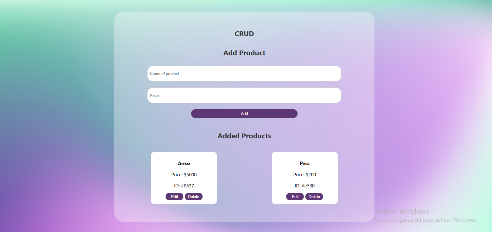

# Product CRUD

This project is a basic web application that allows you to **Create, Read, Update, and Delete (CRUD)** products. It is built with HTML, CSS, and JavaScript, and connects to a backend (such as `json-server`) at `http://localhost:3000/products`.

## 🧰 Technologies Used

- HTML5
- CSS3
- JavaScript
- Fetch API
- [json-server](https://github.com/typicode/json-server) to simulate a REST API

## 📁 Project Structure

📦 CRUD PRODUCT  
├── index.html → Main interface  
├── style.css → Visual styles  
├── app.js → Main CRUD logic  
|── gestion_api.js → Main fetch logic  

## ⚙️ Main Features

### 🔸 1. Create Products
A form with validation that allows you to add a new product with:
- Capitalized name (e.g., "arroz" → "Arroz")
- Price greater than zero
- Duplicate handling

### 🔸 2. Read Products
When the page loads, the current list of products is fetched with `GET` from the API and displayed dynamically in the DOM.

### 🔸 3. Edit Products
When you click the **"Edit"** button, a modal opens with the current product data. Upon saving, a `PUT` request is sent with the new data.

### 🔸 4. Delete Products
The **"Delete"** button removes the product from the API using `DELETE`.

## 🧪 Auxiliary File (`gestion_api.js`)
This additional file shows how to directly test the functions:
- Get products
- Create a new one
- Edit it with the returned ID
- Delete it
- Validate data before any operation

### Validation Function:

```js
function validateProduct(product) {
    if (!product.name || typeof product.price !== "number") {
        console.error("Invalid product data");
        return false;
    }
    return true;
} 
```

### Prerequisites
- Have json-server installed:
        npm install -g json-server

- Start the server:
        json-server --watch db.json --port 3000

🚀 How to Use
Clone this repository or download the files.

Make sure json-server is running.

Open index.html in your browser.

Start adding, editing, or deleting products.

✅ Additional Features
User-friendly edit modal

Automatic name capitalization

Form validation

Duplicate checking

Basic responsive visual style

📌 Notes
This CRUD does not permanently store data in a real database.

📷 Screenshots


🧑‍💻 Author
Mayerly Zapata Rodriguez
